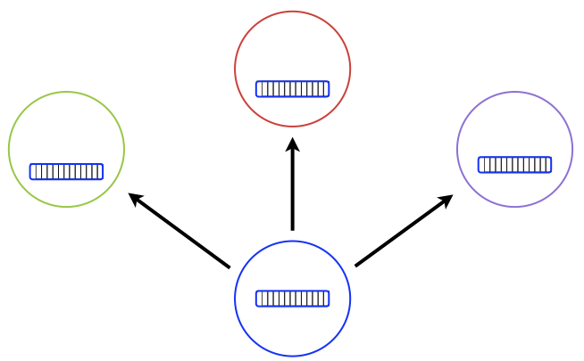

<div>

# Distributed Spinning Cubes Demo - Unity P2P Plugin Tutorial

## Overview

The Spinning Cubes Demo is a simple yet comprehensive example that demonstrates the core functionality of the Unity Peer-to-Peer Networking Plugin. This interactive demo showcases distributed object creation, deletion, synchronization, and real-time manipulation across multiple connected devices.

In this demo, each connected player can:

- Create spinning cube objects that appear on all devices
- Delete cubes in the scene that were created by that same player
- Move cubes around by clicking and dragging
- See color-coded cubes indicating which player created each object
- Experience real-time synchronization across all connected devices

This tutorial will guide you through understanding and implementing the demo, serving as a foundation for building more complex peer-to-peer multiplayer experiences.

### Demo Features

#### Core Functionality

- **Distributed Object Creation**: Create cubes that instantly appear on all connected devices
- **Player Color Coding**: Each player has a unique color, and their created cubes reflect this color
- **Interactive Manipulation**: Click and drag any cube to move it around in 3D space
- **Real-time Synchronization**: All movements and changes are synchronized across devices instantly
- **Cross-platform Support**: Works seamlessly across desktop, mobile, and XR platforms

#### Visual Elements

- **Spinning Animation**: All cubes continuously rotate
- **Player Identification**: Each player's session has a colored outline related to the cube colors for easy identification
- **Smooth Movement**: Dragging provides immediate visual feedback across all devices
- **Clean UI**: Simple user clicking for creating, deleting, and moving objects

---

## Prerequisites

Before starting this demo, ensure you have:

1. **Unity P2P Plugin Installed**: Follow the Getting Started guide in the main documentation
2. **License Configured**: Your P2P Plugin license must be verified
3. **Development Environment**: Either Multiplayer Play Mode or multiple Unity instances/builds
4. **Basic Unity Knowledge**: Familiarity with GameObjects, components, and basic scripting

To use this demo project, you can download or clone it, load it into Unity (make sure you ignore the errors) before you install the plugin from the Package Manager.

## Project Setup

### 1. Scene Preparation

The demo project has a very simple setup:

```
SpinningCubesDemo (Empty GameObject)
├── Directional Light
└── Main Camera
    └── screenCanvasParent
         └── screenCanvas
              └── OutlineShowsColor
```

### 2. Main Scripts

The demo consists of three main scripts:

1. <a href="web/SharedCube.cs" id="linktop2pdemo" class="viewer-link language-csharp">**`DistributedObjects/SharedCube.cs`**</a> - Defines the distributed cube object
2. <a href="web/P2PSharedCubeInteractionHandler.cs" id="linktop2pdemo" class="viewer-link language-csharp">**`Scripts/P2PSharedCubeInteractionHandler.cs`**</a> - Implements the user interactions that add, delete, and move cubes
3. <a href="web/AssignSharedCubeColorsTo.cs" id="linktop2pdemo" class="viewer-link language-csharp">**`Scripts/AssignSharedCubeColorsTo.cs`**</a> - Responsible for assigning the color of the player and setting the cube colors

#### Script Setup

Scripts should be setup and added as components to the scene:

1. **P2P Plugin** - The main P2P plugin script needs to be added somewhere in the scene, such as on the **Main Camera**.  This node should be configured appropriately, as the <a href="https://blainebell.org/P2PPlugin/README.html?scrollToHighlight=pluginconfig" target="_blank" rel="noreferrer noopener">documentation</a> suggests, with the license and multicast parameters.
2. **P2P Shared Cube Interaction Handler** - Should be added somewhere globally, such as the **Main Camera**.
3. **Assign Shared Cube Colors To** - Add globally, such as on the **Main Camera**.
4. **Screen Canvas Script** - Added to **screenCanvas**, sets both transforms for **screenCanvasParent** and **screenCanvas** for screen stabilized coordinate systems, including the **screenCanvas** which is in pixel scale. This script should be configured with the Main Camera.

The **P2P Shared Cube Interaction Handler** should also be configured appropriately:

<div style="width: 30%; margin: auto;">
<center>


</center>
</div>

- **Main Camera** - used for screen to world computations to determine creation, deletion, updates from interaction positions
- **Prefab to Spawn** - For remote SharedCubes, this prefab SmallRotatedCube is created
- **Outline for Color** -  The OutlineShowsColor is used to show the outline around the outside of the view, which is colored by the local player's color


---

### 3. Implementation

This demo is mainly driven by one script <b><a href="web/P2PSharedCubeInteractionHandler.cs" id="linktop2pdemo" class="viewer-link language-csharp">P2PSharedCubeInteractionHandler.cs</a></b> that implements the user interaction and distribution.  Pseudo-code for this script implements the three main mouse/touch events:

<style>


mark {
  display: block;
  margin: 0;
  padding: 0;
 background-color: white !important;
}

</style>

<div id="presection" style="width: fit-content;">
<mark style="margin: 0;" data-id="onPress">
<pre class="onPress hl" href="web/P2PSharedCubeInteractionHandler.cs" highlight="OnPress"><code class="language-csharp">public void OnPress(Vector2 mouseTouchPos) {
    if User Presses a cube:
        Set dragging cube to pressed cube
}
</code></pre></mark><mark style="margin: 0;" data-id="onRelease"><pre class="onRelease hl" href="web/P2PSharedCubeInteractionHandler.cs" highlight="OnRelease"><code class="language-csharp">public void OnRelease(Vector2 mouseTouchPos){
    if no dragging cube:
        Create new cube at mouse/touch position
    else if dragging cube is set and User did not move it:
        Delete dragging cube
}
</code></pre></mark><mark style="margin: 0;" data-id="onMove"><pre class="onMove hl" href="web/P2PSharedCubeInteractionHandler.cs" highlight="OnMove"><code class="language-csharp">public void OnMove(Vector2 mouseTouchPos){
    if dragging cube is set:
        move dragging cube to mouseTouchPos
}
</code></pre>
</div>

This class is a subclass of <a href="web/MouseAndTouchMonoBehaviour.cs" id="linktop2pdemo" class="viewer-link language-csharp">MouseAndTouchMonoBehaviour.cs</a> to support both desktop and mobile platforms.

Each cube is distributed to all other remote devices:

<table style="border: none;width:90%; margin: auto;">
<tr style="border: none;">
<td style="border: none;">

</td><td style="border: none;">


</td>
</tr>
<tr style="border: none; text-align: center;">
<td style="border: none;">Cubes are distributed to all other players</td>
<td style="border: none;">All players have local and remote cubes</td>
</tr>
</table>

<p></p>

Inserts, deletes and updates are replicated using a **one-way distribution mechanism**.  For this demo, we limit these actions to the source player who created the shape.


#### Defining the Distributed SharedCube

The distributed component of this demo is defined in the <a href="web/SharedCube.cs" id="linktop2pdemo" class="viewer-link language-csharp">**SharedCube**</a> class with 4 main sections:


<div id="presection2" style="width: fit-content;">
<mark style="margin: 0;" data-id="begClassDef">
<pre class="hl"><code class="language-csharp">public class SharedCube : P2PNetworkComponent {
</code></pre>
<mark style="margin: 0;" data-id="fieldsandprops">
<pre class="hl" href="web/SharedCube.cs" highlight="range-12-26"><code class="language-csharp"><div class="hljs-comment"><b>  /* 1. Define fields/properties */</b></div>
  public Vector3 translation;
</code></pre></mark><mark style="margin: 0;" data-id="triggerfuncs"><pre class="onRelease hl" href="web/SharedCube.cs" highlight="range-28-50"><code class="language-csharp"><div class="hljs-comment"><b>  /* 2. Add Trigger Functions for Remote */
  /*     Insert/Delete of SharedCube     */</b></div>
  public void AfterInsertRemote() {
    Initialize GameObject and populate data structures
  }
  public void AfterDeleteRemote() {
    Remove from data structures and delete GameObject
  }
  static public GameObject spawnNewRemoteObject() {
    Create new GameObject from prefab
    with SharedCube component and return
  }</code></pre></mark><mark style="margin: 0;" data-id="dsandhelpers"><pre class="onMove hl" href="web/SharedCube.cs" highlight="range-51-74"><code class="language-csharp">  <div class="hljs-comment"><b>&sol;&ast; 3. Static data structures &ast;&sol;</b></div>
  <div class="hljs-comment"><b>/&ast;   and helper functions to setAssignedColor &ast;/</b></div>
  allSharedCubes = new Dictionary&lt;long, SharedCube&gt;();
  assignedColors = new Dictionary&lt;long, Color&gt;();
  void setColorToRenderer(Renderer rend, long peerID) {
    Lookup and set assigned color to renderer
  }
  void setColorToCube(SharedCube sc) {
    Lookup and set assigned color of
	  source computer to SharedCube
  }
  void setColorToGameObject(GameObject go,
                            long peerID) {
    Lookup and set assigned color of
      source computer to GameObject
  }
</code></pre></mark><mark style="margin: 0;" data-id="dsandhelpers"><pre class="onMove hl" href="web/SharedCube.cs" highlight="range-76-79"><code class="language-csharp">  <div class="hljs-comment"><b>&sol;&ast; 4. Need public constructor for remote instantiation &ast;&sol;</b></div>
  public SharedCube()
  {
  }
</code></pre>

</div>

<pre class="hln"><code class="language-csharp">}
</code></pre>

This SharedCube class enables the Peer-to-Peer distribution and hooks the data into the Unity GameObjects for smooth distributed multi-player interactive functionality.

#### Supporting Scripts

There are some scripts that support the demo but do not have demo-specific logic:

1. <a href="web/MouseAndTouchMonoBehaviour.cs" id="linktop2pdemo" class="viewer-link language-csharp"> **`Scripts/MouseAndTouchMonoBehaviour.cs`**</a> - A super class of P2PSharedCubeInteractionHandler.cs and allows support of mobile and desktop interaction using the same callbacks.
2. <a href="web/RotateCube.cs" id="linktop2pdemo" class="viewer-link language-csharp"> **`Scripts/RotateCube.cs`**</a> - A very simple (1-liner) script that rotates cubes on an axis.
3. <a href="web/ScreenCanvasScript.cs" id="linktop2pdemo" class="viewer-link language-csharp"> **`Scripts/ScreenCanvasScript.cs`**</a> - A script that sets the transforms of both screenCanvas and screenCanvasParent to support screen stabilized coordinate system, which is used for the OutlineShowsColor GameObject.
4. <a href="web/ScreenOutline.cs" id="linktop2pdemo" class="viewer-link language-csharp"> **`Scripts/ScreenOutline.cs`**</a> - A script that generates the geometry and sets it to the Mesh of the GameObject.


</div>
